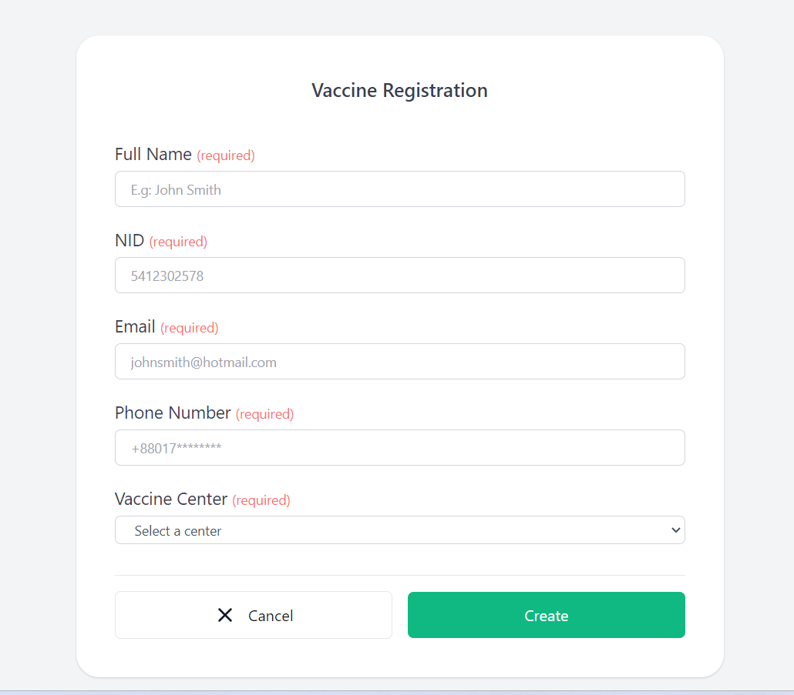
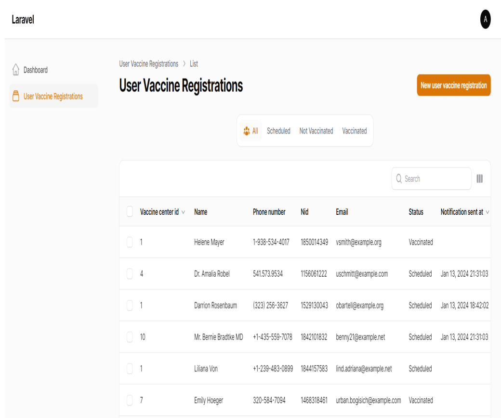
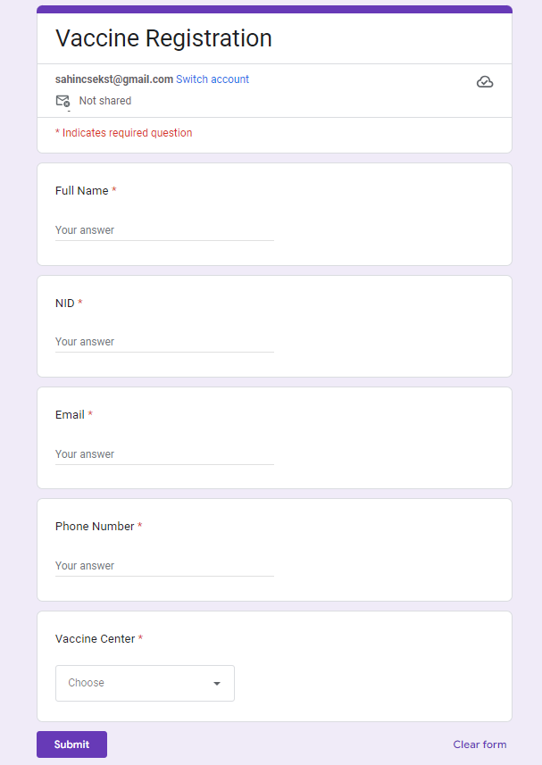

## Laravel: Vaccine Registration System Using queue, task scheduling, Google Form and Zapier 





-----

### How to use

- Clone the project with `git clone`
  ```bash
   (https://github.com/sahinuddinrony/Laravel-Vaccine-Registration-System-with-Google-Form-and-Zapier.git)
  ```
- Copy `.env.example` file to `.env` and edit database credentials there
- Change your `.env` file with:
    - `APP_NAME="Vacci Mate"`.
    - `APP_TIMEZONE=Asia/Dhaka`.
    - `DB_DATABASE=vacci_mate`.
    - `QUEUE_CONNECTION=database`.
    - Rest of set by your own.
- Run `composer install`
- Run `php artisan key:generate`
- Run `php artisan migrate --seed` (it has some seeded data for your testing)
- Run `php artisan serve`
- That's it: launch the main URL

## Mail Configuration
You can use **mailtrap** to set your email configuration testing email in this application. [Here](https://mailtrap.io/blog/send-email-in-laravel/) is the guideline of how to configure mailtrap for laravel.
After set you email server, you are now ready to test email.

### Run queue and task scheduling
 - Run `php artisan queue:work`
 - Run `php artisan  schedule:work`

---

## I also use filament php to see user list in dashboard
### Login Info

> http://127.0.0.1:8000/admin

> email address:  ***admin@test.com***

> password:  ***password***

---

## Integration Webhook
You may set up [zapier](https://zapier.com/) webhook to access request from our application. Zapier is a platform where you can communicate between api to api or software to software. Zapier can trigger an event from thousands of services and can take action or pass payload to another service. To integrate zapier:
- Create a google form exactly like our application register form. [example](https://forms.gle/Pdy5HKZp4V2DzmiWA)
- Create a zapier account.
- Create new zap.
- Connect trigger with the created google form.
- Connect webhook action that point to our application endpoint `/webhook/register`.
- Publish zap.

## Integration Cross Platform Application (Ngrok)
ngrok is a cross-platform application that enables developers to expose a local development server to the Internet with minimal effort. 
You may set up [Ngrok](https://ngrok.com/):
- Create a Ngrok account.
- Create new zap.
- Download Ngrok and Run `ngrok http 80`

## Show Video link for more details
(https://drive.google.com/file/d/1DRxKLLAiHwdXuXVkTDL4FEwUS5xEaVla/view)

## ## Greetings

- [Linkedin](https://www.linkedin.com/in/sahinuddinrony/)

